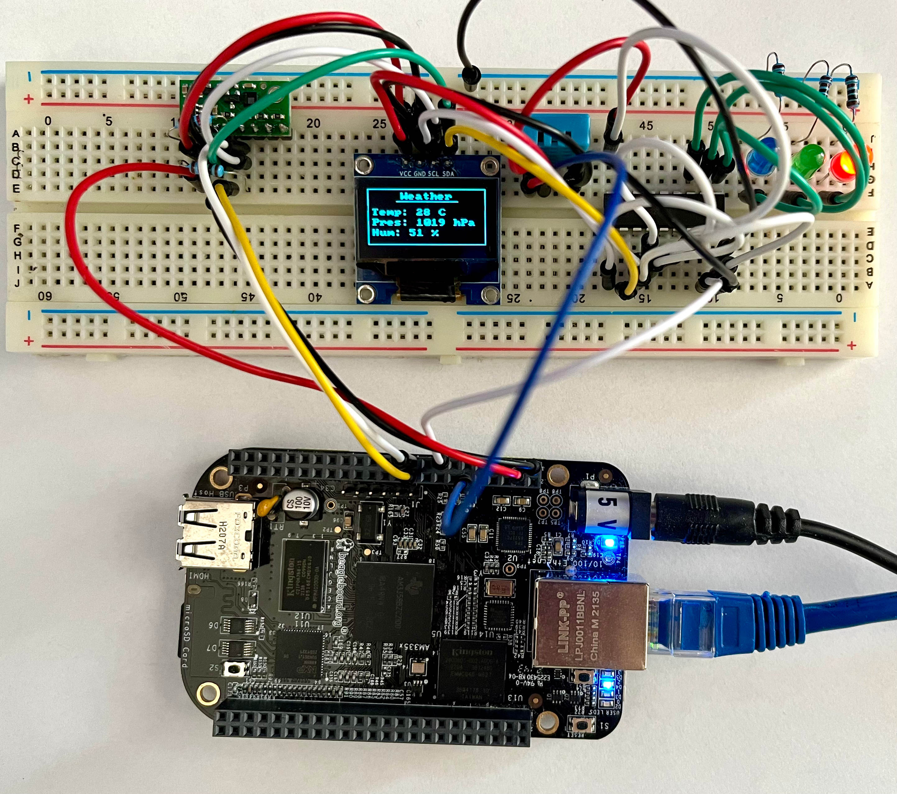
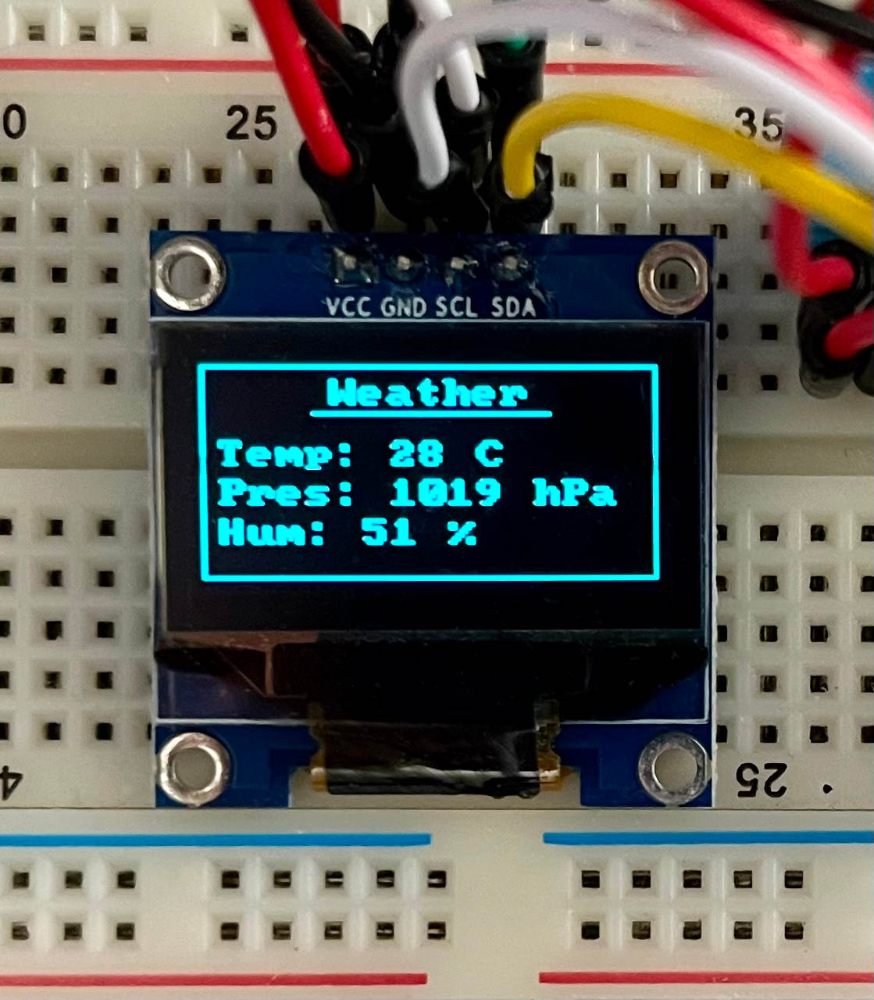
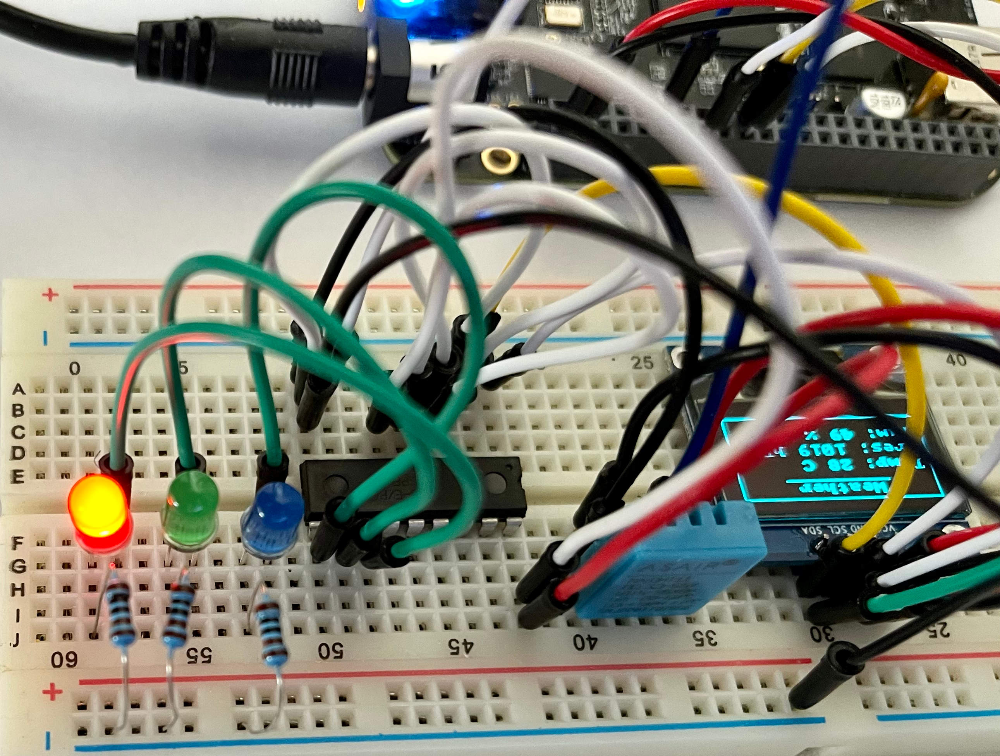
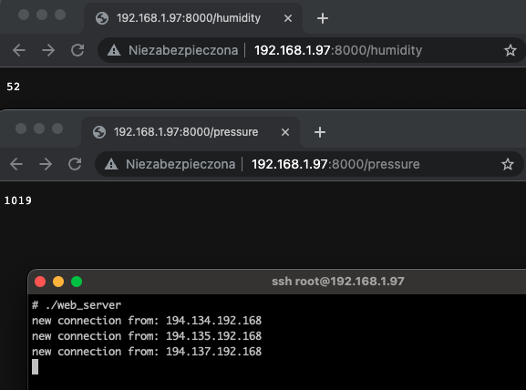

# Weather Station
This repository contains my weather station project, based on embedded Linux.
The project uses [Buildroot](https://buildroot.org/) to generate the system image. Beaglebone Black Rev C has been chosen as a hardware platform.
 
The following components have been developed for this project:
* Kernel driver for LPS25HB barometer.
* Kernel GPIO driver for MCP23008 GPIO expander (uses `regmap`).
* Kernel framebuffer display driver for SSD1306 display.
* User space application (written in C) that displays sensor data on the SSD1306 display. It also controls the LEDs connected to the MCP23008 GPIO expander. The application uses `pthreads` and `gpiod`.
* Simple web server (based on sockets and written in C++) that gives remote access to the sensor data.
* Init scripts that launch applications on startup and configure the system.

Source code for the drivers and the applications can be found in `package` directory. Init scripts are located in `overlay/etc/init.d`.
 
Driver source code can also be found in the following separate repositories:
* SSD1306 display - [https://github.com/mrutkowski2904/ssd1306-linux-display-driver](https://github.com/mrutkowski2904/ssd1306-linux-display-driver)
* MCP23008 GPIO Expander - [https://github.com/mrutkowski2904/mcp23008-linux-gpio-driver](https://github.com/mrutkowski2904/mcp23008-linux-gpio-driver)
* LPS25HB barometer - [https://github.com/mrutkowski2904/lps25hb-barometer-linux-driver](https://github.com/mrutkowski2904/lps25hb-barometer-linux-driver)

Sensor data can be fetched from the web server on the following URLs:
* `<server IP>:<server port>/humidity`
* `<server IP>:<server port>/temperature`
* `<server IP>:<server port>/pressure`

## Pictures
The project:

  
Sensor data on the SSD1306 display:

  
Temperature LEDs:

  
Sensor data fetched from the web server:

## Hardware
Following parts have been used:
* Beaglebone Black Rev C
* SSD1306 display
* MCP23008 GPIO expander
* LPS25HB barometer
* DHT11 temperature and humidity sensor
* Breadboard, leds, jumper wires and resistors